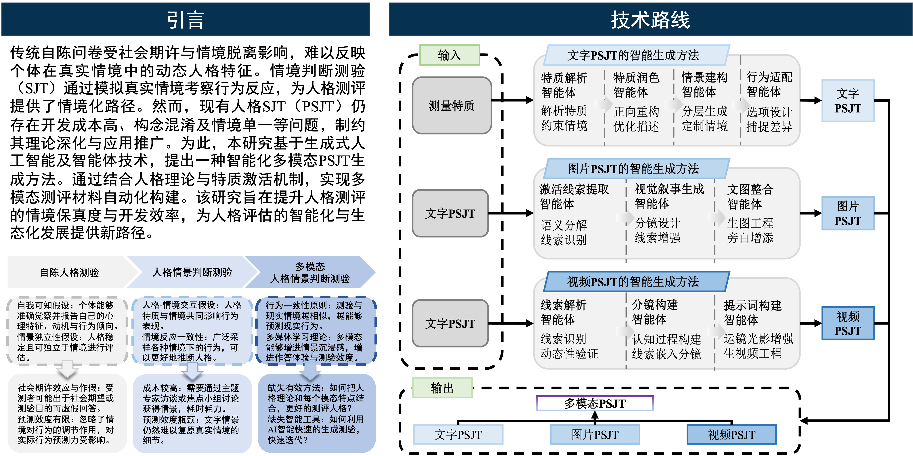
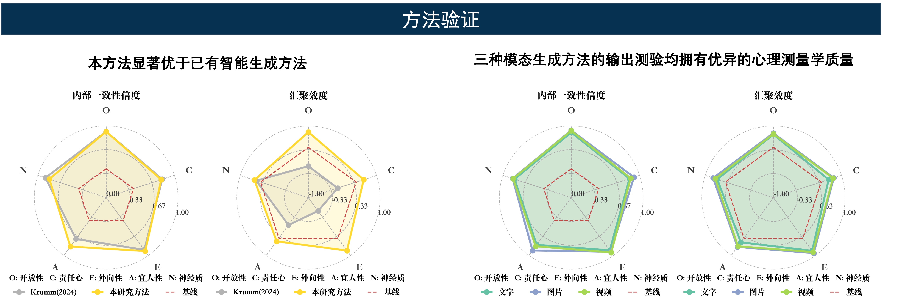

# MultiModal SJT Agent

多模态情境判断测验（SJT）生成平台，支持文本、图像、视频三种形态。

<p align="center">
  
</p>

| 研究流程 | 生成结果 |
| --- | --- |
|  |  |

## 快速开始

```bash
curl -LsSf https://astral.sh/uv/install.sh | sh

# 克隆并启动
git clone https://github.com/PsyAgent/MultiModalSJTAgent.git
cd MultiModalSJTAgent
cp .env.example .env  # 配置 OPENAI_API_KEY

uv sync && uv run python app.py
```

访问 http://localhost:4399

### 题库数据包（可选）

`/quiz`（生成结果）页面展示的是预先生成好的成品题库，因体积较大（约 838MB）未纳入版本控制。需要的话从 [Releases](https://github.com/PsyAgent/MultiModalSJTAgent/releases/tag/data-v1) 下载 `generated.zip`，解压到项目根目录即可：

```bash
unzip generated.zip   # 解压后得到 generated/ 目录，无需额外配置
```

不下载不影响生成功能，只是 `/quiz` 页面会是空的。

<details>
<summary>其他部署方式</summary>

**Docker**
```bash
docker build -t multimodal-sjt-agent .
docker run -d -p 4399:4399 \
  -v $(pwd)/outputs:/app/outputs \
  -v $(pwd)/.env:/app/.env \
  --name sjt-agent multimodal-sjt-agent
```
</details>

## API 示例

生成接口是异步的：提交后立即返回 `task_id`，再轮询任务状态获取结果。生成在服务端后台线程中进行，页面切换或刷新都不会中断。

```bash
# 获取维度列表
curl http://localhost:4399/api/traits

# 1. 提交生成任务，立即返回 task_id
curl -X POST http://localhost:4399/api/generate/text \
  -H "Content-Type: application/json" \
  -d '{"trait_id": "N1", "item_id": "1", "situation_theme": "大学生活"}'
# => {"success": true, "task_id": "a1b2c3...", "status": "running"}

# 2. 轮询任务状态，status 为 running / done / error
curl http://localhost:4399/api/task/a1b2c3...
```

<details>
<summary>更多 API</summary>

```bash
# 生成图像 SJT
curl -X POST http://localhost:4399/api/generate/image \
  -H "Content-Type: application/json" \
  -d '{"trait_id": "N1", "item_id": "1", "ref_character": "male"}'

# 生成视频 SJT
curl -X POST http://localhost:4399/api/generate/video \
  -H "Content-Type: application/json" \
  -d '{"trait_id": "N1", "item_id": "1"}'

# 列出正在运行的任务
curl http://localhost:4399/api/tasks?status=running

# 结果取走后清理任务
curl -X DELETE http://localhost:4399/api/task/a1b2c3...
```

生成结果写入 `outputs/` 目录，通过 `/outputs/<filename>` 访问。任务记录保存在内存中，服务进程重启后丢失。
</details>

---

**技术栈**: Flask · LangChain · LangGraph · OpenCV · InsightFace · MoviePy

**GitHub**: https://github.com/PsyAgent | **Issues**: https://github.com/PsyAgent/MultiModalSJTAgent/issues
